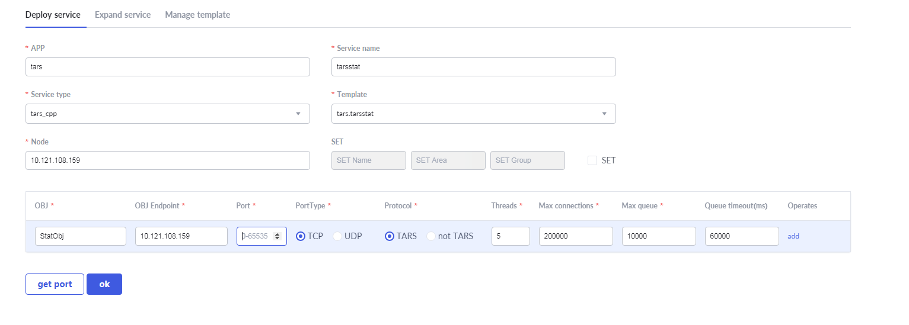
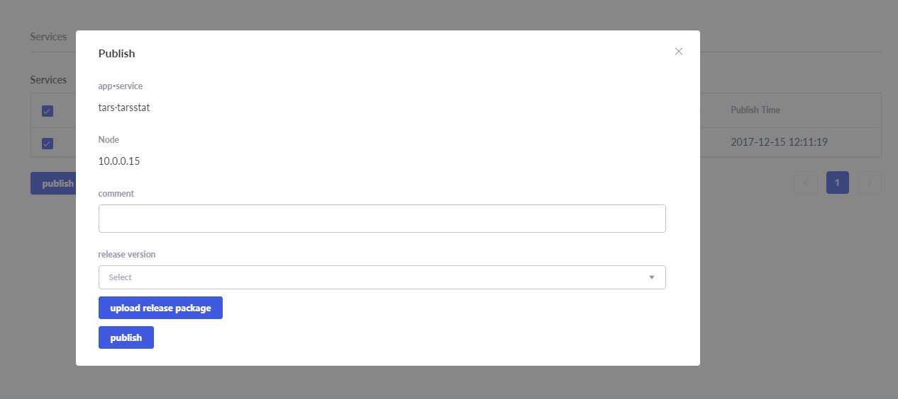
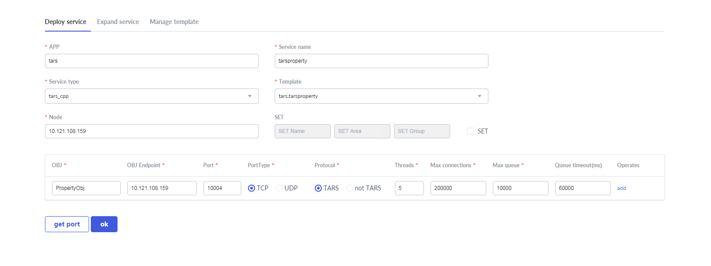
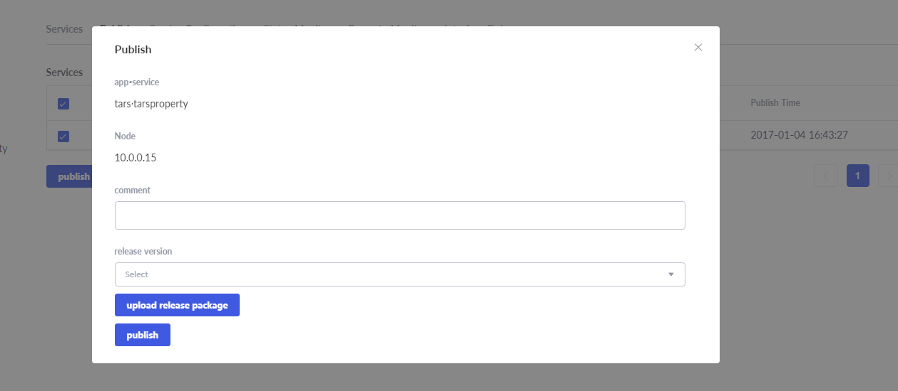
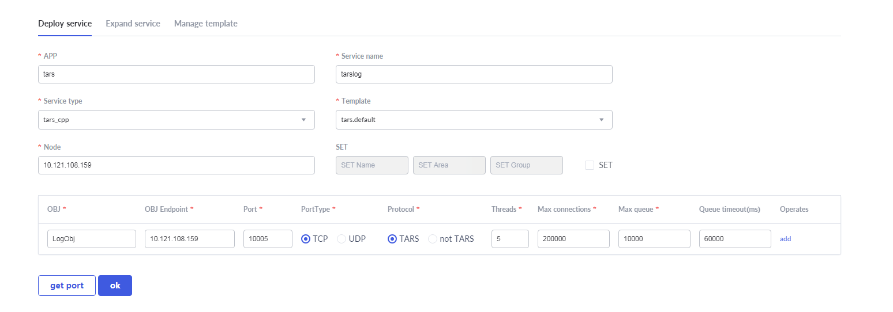
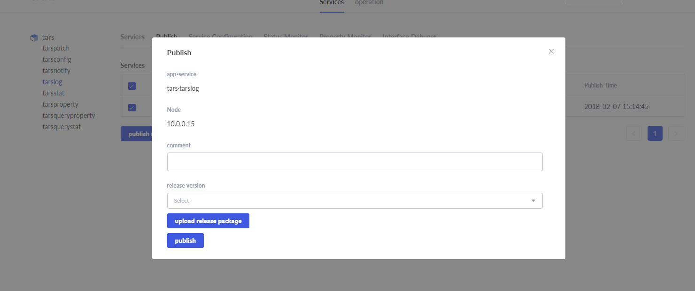
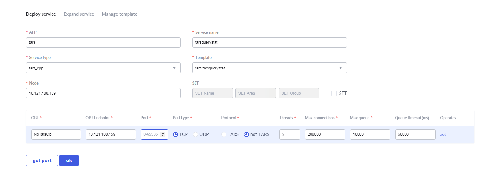
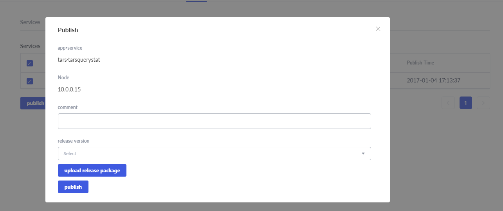
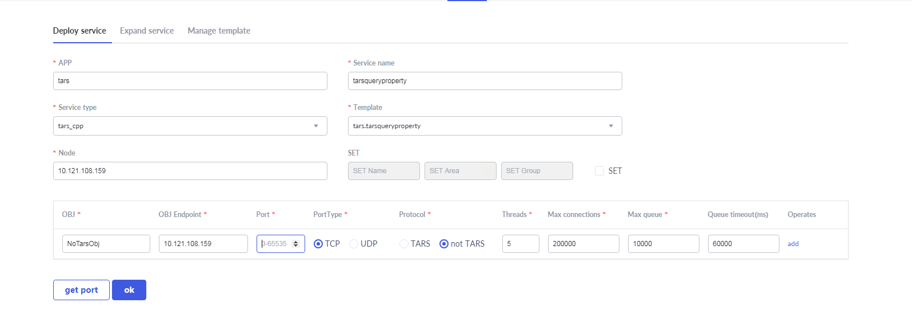
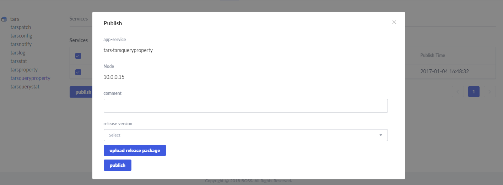

# Contents
> * [Environment Dependence](#chapter-1)
> * [Introduction of Tars's development environment installation](#chapter-2)
> * [Installation of Tars's DB environment](#chapter-3)
> * [Deploymen of the runtime environment for Tars framework](#chapter-4)


This doc described the steps of deploying Tars framework, aimed to make users have a whole cognition of deploy, running and test Tars framework.

If you use Tars for production environment, the deployment steps is similar, but you need pay more attention to fault-tolerant. You can join us for discussion, the QQ group code is 579079160.

# 1. <a id="chapter-1"></a>Dependent environments

Software | Software requirements
------|--------
linux kernel version:   |	2.6.18 or later (Dependent OS)
gcc version:            |   4.1.2 or later¡¢glibc-devel£¨Dependent c++ framework tools£©
bison version:          |	2.5 or later£¨Dependent c++ framework tools£©
flex version:           |	2.5 or later£¨Dependent c++ framework tools£©
cmake version:          |   2.8.8 or later£¨Dependent c++ framework tools£©
resin version:          |   4.0.49 or later£¨Dependent web management system£©
Java JDK version:       | 	JDK1.6 or later; For web management system,£¨JDK 1.8 or later£©
Maven version:          |   2.2.1 or later web management system¡¢dependency of java framework£©
mysql version:          |   4.1.17 or later£¨dependency of framework running£©
rapidjson version:      |   1.0.2 or later£¨dependency of C++ framework£©

Hardware requirements: a machine running Linux.

## 1.1. Install glibc-devel

If you don't have glibc, please install it first.

For example, run this command in Centos:
```
yum install glibc-devel
```

## 1.2. Install cmake

Cmake is the tool for compile tars.

Download cmake-2.8.8 source code, unzip:
```
tar zxvf cmake-2.8.8.tar.gz
```
Enter directory:
```
cd cmake-2.8.8
```
Steps as following(may `sudo root` first ):
```
./bootstrap
make
make install
```

## 1.3. Install resin
resin is the **recommended** running environment for Tars management system.(JDK is needed)
```
cd /usr/local/
tar zxvf resin-4.0.49.tar.gz
ln -s resin-4.0.49 resin
```

## 1.4. Install mysql
Before installation, check whether ncurses and zlib have been installed. Execute these commands if not exist:
```
yum install ncurses-devel
yum install zlib-devel
```

set the installation directory, switch to user root.
```
cd /usr/local
mkdir mysql-5.6.26
chown ${normal user}:${normal user} ./mysql-5.6.26
ln -s /usr/local/mysql-5.6.26 /usr/local/mysql
```

Download mysql source (mysql-5.6.26), set charset to utf-8.
```
cmake . -DCMAKE_INSTALL_PREFIX=/usr/local/mysql-5.6.26 -DWITH_INNOBASE_STORAGE_ENGINE=1 -DMYSQL_USER=mysql -DDEFAULT_CHARSET=utf8 -DDEFAULT_COLLATION=utf8_general_ci
make
make install
```
**Attention: If you use C++ to develop Tars service, please compile mysql as static library.**

Now you can compile Tars framework of C++ version.

If you need build runtime environment for Tars framework, pelease switch to mysql administrator user and config mysql with following steps:
```shell
yum install perl
cd /usr/local/mysql
useradd mysql
rm -rf /usr/local/mysql/data
mkdir -p /data/mysql-data
ln -s /data/mysql-data /usr/local/mysql/data
chown -R mysql:mysql /data/mysql-data /usr/local/mysql/data
cp support-files/mysql.server /etc/init.d/mysql
yum install -y perl-Module-Install.noarch
perl scripts/mysql_install_db --user=mysql
vim /usr/local/mysql/my.cnf
```
Here is an example of my.cnf:

```cnf
[mysqld]

# Remove leading # and set to the amount of RAM for the most important data
# cache in MySQL. Start at 70% of total RAM for dedicated server, else 10%.
innodb_buffer_pool_size = 128M

# Remove leading # to turn on a very important data integrity option: logging
# changes to the binary log between backups.
log_bin

# These are commonly set, remove the # and set as required.
basedir = /usr/local/mysql
datadir = /usr/local/mysql/data
# port = .....
# server_id = .....
socket = /tmp/mysql.sock

bind-address={$your machine ip}

# Remove leading # to set options mainly useful for reporting servers.
# The server defaults are faster for transactions and fast SELECTs.
# Adjust sizes as needed, experiment to find the optimal values.
join_buffer_size = 128M
sort_buffer_size = 2M
read_rnd_buffer_size = 2M

sql_mode=NO_ENGINE_SUBSTITUTION,STRICT_TRANS_TABLES

```
Start mysql
```
service mysql start
chkconfig mysql on
```
Stop mysql
```
service mysql stop
```
Add mysql execution path to environment variable for path.
```
vim /etc/profile
PATH=$PATH:/usr/local/mysql/bin
export PATH
```
Modify root's password
```
./bin/mysqladmin -u root password 'root@appinside'
./bin/mysqladmin -u root -h ${hostname} password 'root@appinside'
```


Add mysql dynamic library path to environment variable for path.
```
vim /etc/ld.so.conf
/usr/local/mysql/lib/
ldconfig
```
========================

The master-slave configuration for mysql can be found in internet.

Grant authority to master
```
GRANT REPLICATION SLAVE ON *.* to 'mysql-sync'@'%' identified by 'sync@appinside'
```
Configure slave for replication
```
change master to master_host='${slave Ip}',master_user='mysql-sync',master_password='sync@appinside' ,master_log_file='iZ94orl0ix4Z-bin.000004',master_log_pos=611;
stop slave
start slave
show master status\G;
show slave status\G;
```

# 2. <a id="chapter-2"></a>Install develop environment for Tars
## 2.1. Install develop environment for web management system
For linux£º
Download JDK, unzip and install.

Configure environment.
```
vim /etc/profile
```
Add following contents to /etc/profile:
```
export JAVA_HOME=${jdk source dir}
CLASSPATH=$JAVA_HOME/lib/dt.jar:$JAVA_HOME/lib/tools.jar
PATH=$JAVA_HOME/bin:$PATH
export PATH JAVA_HOME CLASSPATH
```
Execute command:
```
source /etc/profile
```
Test:
```
java -version
```

Install maven
Download maven, unzip and install:

Configure environment variables
```
vim /etc/profile
```
Add these lines:
```
export MAVEN_HOME=${maven source dir}
export PATH=$PATH:$MAVEN_HOME/bin
```
Execute command
```
source /etc/profile
```
Test
```
mvn -v
```

## 2.2. Install develop environment for java language framework

Environment configuration for JDK and maven is similar to that of web management system.

**Attention: Make sure that your machine can access to internet, then modify file setting.xml from conf directory in the installed path of maven.

Download tars code, change to java source directory, and install:
```
mvn clean install 
mvn clean install -f core/client.pom.xml 
mvn clean install -f core/server.pom.xml

```
Build web project
Use IDE or maven to create a maven web project, use eclipse as example, choose File -> New -> Project -> Maven Project -> maven-archetype-webapp£¬then enter groupId, artifactId£¬when finished use eclipse to import, the directory architecture is as following:


Add dependency configuration in Maven


Plugin dependency configuration


## 2.3. Install develop environment for C++
Download tars source, change to directory `cpp/thirdparty`, execute `thirdparty.sh` script to download rapidjson.

Then change to cpp/build.
```
cd {$source_folder}/cpp/build
chmod u+x build.sh
./build.sh all
```
**Be care that the default mysql lib path which Tars use is /usr/local/mysql/ .
If mysql is installed in different path, please modify the file CMakeLists.txt in `build` directory before compile.**

Recompile if needed
```
./build.sh cleanall
./build.sh all
```

Change to user root, create the installation directory.
```
cd /usr/local
mkdir tars
chown ${normal user}:${normal user} ./tars/
```

installation
```
cd {$source_folder}/cpp/build
./build.sh install or make install
```
**The default install path is /usr/local/tars/cpp¡£**

**If you want to install on different path£º**
```
**modify build/CMakeLists.txt**
**modify TARS_PATH in servant/makefile/makefile.tars**
**modify DEMO_PATH in servant/script/create_tars_server.sh**
```

# 3. <a id="chapter-3"></a>Initialize the db environment for Tars
## 3.1. Add user
```sql
grant all on *.* to 'tars'@'%' identified by 'tars2015' with grant option;
grant all on *.* to 'tars'@'localhost' identified by 'tars2015' with grant option;
grant all on *.* to 'tars'@'${hostname}' identified by 'tars2015' with grant option;
flush privileges;
```
**Attention: Modify ${'localhost'} to real hostname from /etc/hosts

## 3.2. Create DB
Search the ip in the script under `cpp/framework/sql`,and replace with the above ip.

```
sed -i "s/192.168.2.131/${your machine ip}/g" `grep 192.168.2.131 -rl ./*`
sed -i "s/db.tars.com/${your machine ip}/g" `grep db.tars.com -rl ./*`
```

Execute
```
chmod u+x exec-sql.sh
./exec-sql.sh
```

After execution of the script, there will be three databases created: db_tars, tars_stat and tars_property.

db_tars is the core database for framework, it consists of services info, service templates and service configuration, etc.
tars_stat is the database for service monitor data.

tars_property is the database for service properties monitor data.

# 4. <a id="chapter-4"></a>Build runtime environment for Tars framework

## 4.1. Packing the basic framework service


There are two kinds of framework services: 
One is basic core service(required), must be deployed by yourself.
The other is basic general service, must be patched by management system.

```
The basic core services: 
tarsAdminRegistry, tarsregistry, tarsnode, tarsconfig, tarspatch
The basic general services:
tarsstat, tarsproperty,tarsnotify, tarslog£¬tarsquerystat£¬tarsqueryproperty
```
First get the core services package, change to cpp/build directory and input:
```
make framework-tar
```
Framework.tgz will be created in current directory
It contains tarsAdminRegistry, tarsregistry, tarsnode, tarsconfig and tarspatch deployment files.

Then make the general service package:
```
make tarsstat-tar
make tarsnotify-tar
make tarsproperty-tar
make tarslog-tar
make tarsquerystat-tar
make tarsqueryproperty-tar
```
The patch package can be deploy after the patch of management platform, see details in chapter 4.4

## 4.2. Install basic core service for framework
## 4.2.1. Install basic core service

Change to user root, and create the deploy directory for basic service:
```  shell
cd /usr/local/app
mkdir tars
chown ${normal user}:${normal user} ./tars/
```
Copy the framework service package to /usr/local/app/tars/ and unzip:
``` shell
cp build/framework.tgz /usr/local/app/tars/
cd /usr/local/app/tars
tar xzfv framework.tgz
```

Modify the configuration file in corresponding conf directory for each service, pay attention
to modify the ip address to your host's address:
``` shell
cd /usr/local/app/tars
sed -i "s/192.168.2.131/${your_machine_ip}/g" `grep 192.168.2.131 -rl ./*`
sed -i "s/db.tars.com/${your_machine_ip}/g" `grep db.tars.com -rl ./*`
sed -i "s/registry.tars.com/${your_machine_ip}/g" `grep registry.tars.com -rl ./*`
sed -i "s/web.tars.com/${your_machine_ip}/g" `grep web.tars.com -rl ./*`
```
Execute tars_install.sh script in directory /usr/local/app/tars/ to start tars framework service:
```
chmod u+x tars_install.sh
tars_install.sh
```
** If services are deployed on different machines, you need to deal with tars_install.sh script things manually.**

Deploy management platform and launch web management platform to deploy tarspatch (the management platform and tarspatch must in the same machine), change to user root and execute:
```
tarspatch/util/init.sh
```
**Play attention, after executing of above script, check if rsync alive.**

Deploy tarspatch on management platform.
Deploy tarsconfig on management platform.

you need configure monitor for tarsnode by crontab, ensure it'll be launched after crash:
```
* * * * * /usr/local/app/tars/tarsnode/util/monitor.sh
```

## 4.2.2. Install tarsnode before scale up

After success of basic core service installation, if you need to deploy tars-based service on different machine,
install tarsnode first.

If you only deploy service on a single machine, ignore this section.

The details are similar to those described in last section.
Change to user root, create the directory for deploy service in, as following:
```  shell
cd /usr/local/app
mkdir tars
chown ${normal user}:${normal user} ./tars/
```

Copy the framework service package to /usr/local/app/tars/:
``` shell
cp build/framework.tgz /usr/local/app/tars/
cd /usr/local/app/tars
tar xzfv framework.tgz
```
Modify the configuration file in corresponding conf directory for each service, don't forget
to modify the ip address to your host's address:
``` shell
cd /usr/local/app/tars
sed -i "s/192.168.2.131/${your_machine_ip}/g" `grep 192.168.2.131 -rl ./*`
sed -i "s/db.tars.com/${your_machine_ip}/g" `grep db.tars.com -rl ./*`
sed -i "s/registry.tars.com/${your_machine_ip}/g" `grep registry.tars.com -rl ./*`
sed -i "s/web.tars.com/${your_machine_ip}/g" `grep web.tars.com -rl ./*`
```
```
chmod u+x tarsnode_install.sh
tarsnode_install.sh
```

Configure a checking crontab for tarsnode,ensuring it's always alive:
```
* * * * * /usr/local/app/tars/tarsnode/util/monitor.sh
```

## 4.3. Install web management system

>** Install tars java framework first, see section 2.2**

> The name of the directory where management system source code in is **web**

Modify the configuration file, save it to the path web/src/main/resources/
- app.config.properties  
  Modify DB configuration

```ini
# db_tars
tarsweb.datasource.tars.addr={$your_db_ip}:3306
tarsweb.datasource.tars.user=tars
tarsweb.datasource.tars.pswd=tars2015

# Public package store path
upload.tgz.path=/usr/local/app/patchs/tars.upload/
```

- tars.conf  
   Substitute registry1.tars.com£¬registry2.tars.com with real ip, concatenate multiple address with colon.

```xml
<tars>
    <application>
        #proxy config
        <client>
            #address
            locator = tars.tarsregistry.QueryObj@tcp -h registry1.tars.com -p 17890:tars.tarsregistry.QueryObj@tcp -h registry2.tars.com -p 17890
            sync-invoke-timeout = 30000
            #timeout(ms)
            max-invoke-timeout = 30000
            #interval for refresh endpoint(ms)
            refresh-endpoint-interval = 60000
            #invoke between modules [optional]
            stat = tars.tarsstat.StatObj
            #async thread
            asyncthread = 3
            modulename = tars.system
        </client>
    </application>
</tars>
```

Package: execute following command in web directory, then tars.war will be created in web/target.
```
mvn clean package
```

Web patch
Put tars.war into /usr/local/resin/webapps/
```
cp ./target/tars.war /usr/local/resin/webapps/
```

Create log directory
```
mkdir -p /data/log/tars
```

Modify conf/resin.xml in Resin directory

Modify the default configuration
```xml
<host id="" root-directory=".">
    <web-app id="/" root-directory="webapps/ROOT"/>
</host>
```
to
```xml
<host id="" root-directory=".">
    <web-app id="/" document-directory="webapps/tars"/>
</host>
```

Launch resin
/usr/local/resin/bin/resin.sh start

Visit the website, input ${your machine ip}:8080 into browser:


## 4.4. Install general basic service for framework
### 4.4.1 Deploy and patch tarsnotify

By default, tarsnofity is ready when install core basic service:


Upload patch package£º


### 4.4.2 Deploy and patch tarsstat

Deploy message:



Upload patch package£º



### 4.4.3 Deploy and patch tarsproperty

Deployment message:



Upload patch package£º



### 4.4.4 Deploy and patch tarslog

Deployment message:



Upload patch package£º



### 4.4.4 Deploy and patch tarsquerystat

Deployment message:



**Pay attention: please select non-Tars protocol, because web platform use json protocol to get service monitor info.**

Upload patch package£º



### 4.4.4 Deploy and patch tarsqueryproperty

Deployment message:



**Pay attention: please select non-Tars protocol, because web platform use json protocol to get service monitor info.**

Upload patch package£º


